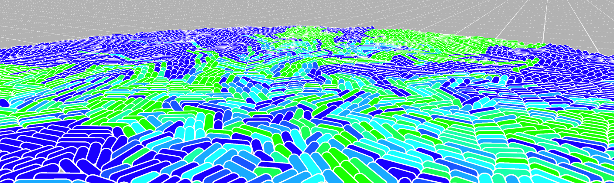

WebCM
=====

WebCM is a web platform used to develop and run bacterial simulations in a lab environment.

# Installation

WebCM uses CellModeller to perform cellular simulations. You do not need CellModeller to run WebCM if you only want to view simulation, however, if you want to run them, you'll have to have CellModeller installed. This means that the installation of CellModeller is not done by default when installing WebCM and is left up to the user. 

## Setting up WebCM

First, run the following to clone the repository:

	git clone https://github.com/RudgeLab/WebCM.git

You then need to install the required Python packages by running:

	pip install -r requirements.txt

You will also need to create the database used be Django. To do this, navigate to the server's root directory (under `WebCM/`) and run:

	python ./manage.py migrate

(You only need to do this once)

### Creating an admin user

WebCM uses Django's built-in user management system. You will first need to create an admin user. To do this, go to the server's root directory and run the following command

	python ./manage.py createsuperuser

This needs to be done AFTER the database has been created. If you then run the server, you will be able to log in to the admin page. By default, this is located at `localhost:8000/admin/`.

WebCM doesn't have its own user management page, so if you want to add users you will have to do it through the admin page.

### Running the server

To run the server, navigate to the server's root directory and run:

	python ./manage.py runserver

By default, this will start WebCM on `localhost:8000/`.

## Setting up CellModeller

### Installing PyOpenCL

CellModeller uses PyOpenCL to run simulation code on the GPU. It is not recommended that you build PyOpenCL manually, as it requires you to have the OpenCL SDK installed. Instead, it is recommended that you use something like Conda Forge to download pre-build packages. 

To do this, start by installing [Miniforge](https://github.com/conda-forge/miniforge/releases/latest/).  Then, open a terminal, activate your conda environment (`root` is the default one) and run `conda install pyopencl`. 

More details instructions can be found here: [https://documen.tician.de/pyopencl/misc.html](https://documen.tician.de/pyopencl/misc.html) (you only really need to read the *"Installing PyOpenCL"* section).

### Installing CellModeller

After you've installed PyOpenCL, you can install CellModeller.

Start by cloning the repository at [https://github.com/RudgeLab/CellModeller](https://github.com/RudgeLab/CellModeller). Then, navigate to the new directory and just run `python ./setup.py install`.  

## User Documentation

Please refer to the [USERDOCS.md](./Documentation/USERDOCS.md) file for user documentation.

